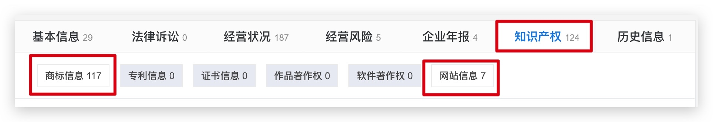
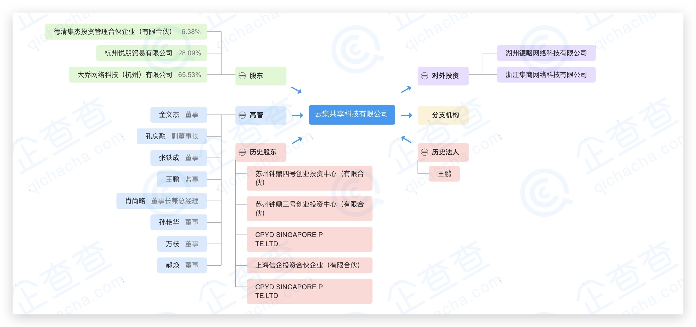
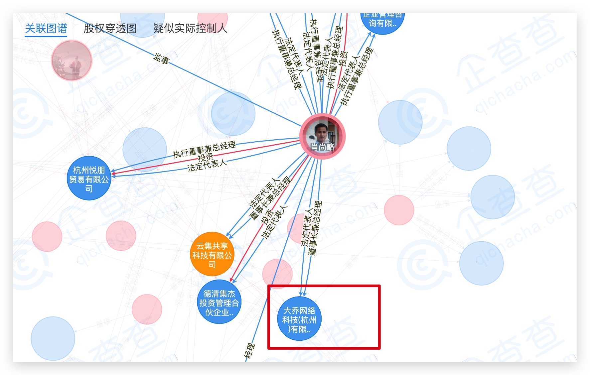

## 〇、目录

[TOC]
一、摘要
二、背景
三、分析过程

思路
行业发展
公司基础信息
公司背后的网络（投融资网络）

四、结论
五、参考资料

## 一、摘要

这是开智学堂「信息分析」课程第3周任务报告，包含分析背景、思路与分析步骤、主要结论、参考文献等内容，完整重现我获得此题目答案的过程。

## 二、背景

> 使用至少 2 个实践策略，获取对某 1-2 家公司的全局认识，进行交叉验证，形成一份信息报告。可以是你工作过的公司，可以从 IT桔子 - 千里马俱乐部 挑选感兴趣的公司。
> 
> Ps. 如涉及个人真实信息，建议使用 ABC 等代号描述，保护个人隐私信息。

结合自己的工作（美妆电商，网红电商）新趋势，挑选了走社交电商模式的「云集」和「礼物说」。很多人预测「社交电商」是下一个电商爆发点，自己的朋友圈也开始有人在做社交电商了（云集、每日一淘、蜜芽等），从兴趣出发找了这个切入点。

## 三、分析过程

### （一）思路

实践策略使用卡包中提到最关键的知识点：

* 行业发展情况
* 公司背后的网络
* 产品分析

### （二）行业发展情况

1、搜索指数

「社交电商」一词在2018年4月6日之前百度搜索指数为0，2018年6月7日迎来第一个搜索指数高峰，从10月初开始整体搜索趋势不断增长。

再来看看微信指数，微信最多能显示90天的数据，与百度指数交叉验证，结论一致。从10月初「社交电商」不断增长。

2、 行业报告

「社交电商」也算是新兴概念，没想到还是有报告的。一共搜索到2份比较全面的报告。

* [2017年行业研究报告--华泰证券](https://crm.htsc.com.cn/doc/2017/10720102/c3e2e113-2250-410e-a11c-a6a28546d1c6.pdf)
* [艾媒报告 | 2018Q1中国社交电商行业市场研究报告](http://www.iimedia.cn/61457.html)

综合计分报告，得到如下信息：
①社交电商发展背景正如华泰证券分析：

> 网购增速回落与寡头格局之下，电商引流成本快速上升。移动时代，微信等
> 社交媒体成为移动端最主要的流量入口，因此将社交元素与电商融合的社
> 交电商模式为电商降低引流成本提供了良好的解决方向。

②什么是「社交电商」？

> 社交电商指利用社交媒体帮助消费者作出决策及获取产品和服务的电子商务活动。企业通过社交网络推广产品、渠道、提供信息服务，用户则从社交网络平台获取信息资源、购买商品。--华泰证券
> 所謂「社交電商」是基於人際網路透過社交媒介如微博、微信、抖音等，進行社交互動、用戶自製內容等手段來輔助商品的購買，同時將關注、分享、互動等社交元素應用在交易過程中，成為電子商務與社交媒體融合後的社交型交易模式。---中時電子報

简单说，是因为传统媒介流量越来越贵，成本越来越高，「社交电商」和之前的「沟通说服」过程有什么不同？媒介有了变化，通过「社交媒介」触达用户，与用户沟通，这种导购方式是拓展认知边界的过程，购买未知产品，不断种草，刺激需求。

③「社交电商」的分类

* 微商
* 红人电商
* 内容社交电商
* 拼团电商

④典型平台

挑选了两家同类型「社交电商」平台，「云集」和「礼物说」。

### 公司基础信息

1、基本面
在 [国家企业信用信息公示系统](http://www.gsxt.gov.cn/index.html) 查询两家公司的工商信息。

| 名称 | 成立时间 | 公司全称 | 法人 |
| --- | --- | --- | --- |
| 云集 | 2013年3月5日 | 云集共享科技有限公司 | 肖尚略 |
| 礼物说 | 2014年9月19日 | 北京礼物说科技有限公司 | 温成辉 |

> 云集微店是一个提供一站式个人零售服务解决方案的电商APP，加云集微店提供海量美妆、母婴等货源，并为用户搭建宣传推广，店主仅需通过分享完成商品的分销零售即可。
> 
> 礼物说，新一代移动电商，主打礼物和全球好货指南，主要涵盖礼物、家居、服装、饰品、零食等类目，目前有导购和自营两种商业模式。针对送礼物和挑选生活好物的痛点，用户既可以查看每日精选推荐，从送礼物、挑选家居用品和服装零食等多场景获取热门的导购指南；也可以在自营模块挑选国内、国外的精品好物。礼物说采用“媒体+电商”的运营模式，提前为用户构建使用场景。温城辉认为，通过“场景”能够跟用户更好地建立情感连接，场景化是电商3.0的重要趋势。

2、治理结构

* [云集微店-企查查](https://www.qichacha.com/product_8a17231c-8c03-4260-a7cd-73987f5b9d87.html)
* [北京礼物说科技有限公司-企查查](https://www.qichacha.com/firm_28baae147821635293bfab1620bce46f.html)

云集大股东是「大乔网络科技（杭州）有限公司」。

礼物说大股东是「温城辉」。

3、知识产权

云集一共有300个商标信息，特别的是一家平台拥有化妆品的外观设计专利，还注册了品牌的及吉祥物IP「小云鸡」，猜测云集也自己在研发产品，有自有品牌，但是谷歌搜索 `云集 素野`，得到的情报是在云集上有卖，素野最有名的产品是面膜。

礼物说一共有117个商标信息，7个网站。网站有布局家居、时尚类。但是除了礼物说，其他网页都打不开。

4、公司变更历史

观察到云集曾经历史更过名称，杭州博略网络科技有限公司→杭州博略生物科技有限公司 （2014）→云集共享科技有限公司（2017），一看到「生物科技」几个字，再结合「知识产权」中云集有「素野化妆品」专利，感觉有东西可以挖。

在淘宝上搜索素野，搜索到品牌店，进一步查到了背后公司。大乔网络科技（杭州）有限公司→小也（2018），而且小也公司和云集的住所在同一幢大厦，大乔网络科技（杭州）有限公司是云集的最大股东。

搜索`杭州博略生物科技有限公司`，发现了如下信息：

大乔网络科技（杭州）有限公司、云集和小也关系紧密，综合起来，证实了之前的假设，云集是靠分销面膜起家的，素野是大乔网络科技（杭州）有限公司（云集）的品牌，在云集平台销售，成为云集爆款（写到这里有点激动，这是没有公开的信息）。

2015年法定代表人、股东和行业的变化是她发展的转折点，王诗剑退出，肖尚略来了以后，现在的大股东大乔网络科技（杭州）有限公司也来了，也有了之后一系列的融资。（后面看投融资网络，肖尚略也是大乔网络科技（杭州）有限公司的法人，原来是一家的。）

相比云集，礼物说的变更为经营范围和住所的变更。

### 公司背后的网络（投融资网络）

1、云集

云集的企业图谱

关联图谱得到信息，肖尚略也是大乔网络科技（杭州）有限公司的法人，云集和果壳网也有关系。

2、礼物说没有观察到特别的资讯。

### 结论

目前，总结下来两家公司，云集做分销起家，自带分销基因，从化妆品出发，礼物说从礼物社交出发，两家是不同的商业模式。

### 参考资料

* [吸引網民買單 社交電商成寵兒 - 中時電子報](https://www.chinatimes.com/newspapers/20180630000183-260301)
* [云集借小云鸡布局新零售新业态__财经头条](https://t.cj.sina.com.cn/articles/view/1784473157/6a5ce64502000ulv7)
* [HK Smallyes Holdings Limited - 香港公司註冊查詢](https://www.hongkongcompanylookup.com/company?utm_source=1625876)

## ChangeLog

* 原始数据：
* 建立时间：
    * 2018-12-26 06:55-08:07 决定选那两家公司
    * 2018-12-27 13:36-19:37 初稿

