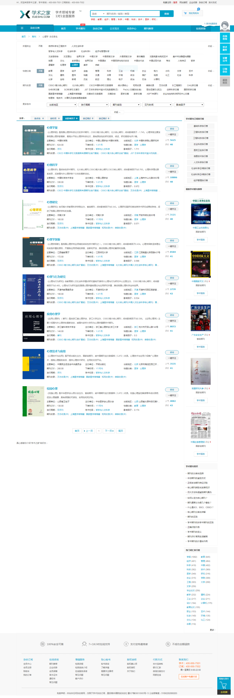

## 1.题目

### 1.1Ch2 进阶作业 ①

运用至少两种实践策略，形成对「心理学」或自己感兴趣领域的全局认识，记录探索过程，完成一份信息分析报告。
注意：使用的实践策略中须包含「批量下载 1000 篇论文」。
我选择「心理学」这个学科

## 2.本质

### 2.1这道题本质上是全局认识的实践策略检核。这道题可以转化为：作为一个心理学的外行 ，我如何通过上周所学选用合适的实践策略快速获得心理学的最小全局认识？

### 2.2第二周时间策略

下载一千篇论文
找问题背后的学科
批量阅读1000篇论文
获取在线知识图谱
本地制作知识图谱
抽样阅读
结构阅读
深入理解概念
altmetric获得文献社会引用指标
用zotero分析1000篇论文

### 2.3我可以选用的策略有

获得在线知识图谱
深入理解一个概念（心理学）
下载并分析1000篇论文
结构阅读法

## 3.分析与实现方式

### 3.1对一个科学领域的最小全局认识，主要包含以下几个方面

* 核心知识体系——维基百科与高等院校网站

> 源头
> 解决的问题
> 背景
> 核心要点
> 
> * 话语体系——心理学教材与高端教育网站
> * 发展脉络——心理学教材与高端教育网站
> * 其他学科交叉与评价——在线知识图谱
> * 中国国情下最新一批学术范围的代表
> * 博士论文——知网1000篇论文阅读与分析
>     关键词聚合
>     研究方法变化
>     导师脉络
> * 学校排名即分布——中国高等教育网站
> * 顶级期刊——期刊排名
> 
> ## 4.操作
> 
> ### 4.1网站
> 
> * 维基百科:[www.wiki.com](http://www.wiki.com/)查核心知识体系、核心知识体系、话语体系、发展脉络
>     
> * 中国教育网：学校排名
>     
>     -eyePlore、acemap查学科知识图谱 
> 
> acemap:[https://www.acemap.info/topic?topicID=00F03FC7](https://www.acemap.info/topic?topicID=00F03FC7)
> 

### 4.2期刊网查心理学领域SJRif指数高的核心期刊

全球[https://www.scimagojr.com/journalrank.php?area=3200](https://www.scimagojr.com/journalrank.php?area=3200)

中国:没有

国内：[https://www.xueshu.com/qikan/xlx/p21.html](https://www.xueshu.com/qikan/xlx/p21.html)

### 4.3书籍：本科教材心理学史查看核心知识体系、话语体系、发展脉络

心理学史

### 4.4数据库

#### 4.4.1下载1000篇论文

知网：[http://www.cnki.net/](http://www.cnki.net/](http://www.cnki.net/](http://www.cnki.net/)

zotero

#### 4.4.2抽样阅读

### 4.5论文分析

#### 4.5.1基本信息

一共下载1227篇博士论文
从1996年到2018年最新博士论文
来自74所大学几乎囊括了全国所有俱备博士点的院校

#### 4.5.2关键词聚合

待统计

#### 4.5.3研究方法变化

待分析

#### 4.5.4部分院校导师梳理

* 北京大学
    李量-杜忆
    刘壮虎-郭美云
    王登峰-杨烨
* 北京师范大学
    林崇德-沃建中
    刘儒德-沈彩霞
    彭聃龄-丁国盛
    申继亮-田宏杰
    郑日昌-张雯舞
* 华东师范大学
    陈国鹏-丁晓攀、周丽清、张亚、刘晓燕、
    崔丽娟-邓棉琳、王婧、郝振、石晶、
    丁钢-田若飞
    董晓蔚-李骏、桑康宁
    杜晓新-杨宇然
    方俊明-韩泰铉、贺荟中、谢国栋、赵微、刘春玲、李闻戈、苏雪云、张旭、徐浙宁、李伟亚
    高瑞泉-李锦招
    高文-王文静、黄都
    耿文秀-鲍立铣、张衍、曹经纬、俞晓歆、
    郭秀艳-刘志远、刘映杰、陈维雯、李锋盈、李菲菲、乔福强、贾永萍、王小艳、凌晓丽
    何子江-周柳
    胡谊-成晓君
    季浏-李樑、马嵘、李佳川
    金瑜-边玉芳
    孔克勤-杨秀君、佘凌、刘同辉、张劲松、陈妙、李艺敏、张增修
    李其龙-肖旻婵、熊哲宏、吴国宏、丁芳、张坤、曾守锤、林小鶯、左志宏、傅丽萍、王蕾、李梦霞、刘明、王晓辰、蔡丹、林彬、潘发达、张恩涛、魏威
    李晓文-安秋玲、刘少英、乌阿茹娜、刘建鸿、马川、江楠楠
    梁宁建-邱扶东、吴明证、杨福义、张乐、奚珣、李宁、祁乐瑛、贺雯、陈进、徐强、孜维达·阿不都克里木（Ziwida. Abdukeram）、高旭辰、
    刘大为-阮文善
    刘永芳-张湘一、孙庆洲、方学梅、胡湛、卢光莉、赵立军、谢伟、邓光辉、余鹏、张葳、钟俊
    马和民-杨英
    缪小春-李凌、杨金鑫、曾凡林
    庞维国-韩建涛、王丽霞
    皮连生-郭裕建
    桑标-席居哲、李亚真、刘肖岑、王荣、包蕾萍、马伟娜、陆洋、张晓贤、张长英、丁雪辰、赛李阳、邓欣媚
    邵志芳-吴君
    王振宇-武建芬、杜燕红、赵一仑
    吴庆麟-钱文、汪航、胡谊、杜伟宇、张振新、李同吉、王婷婷、张裕鼎、陈松、袁欢、赵立影、公彦霏
    熊哲宏-倪伟、胡林成、刘永琴、奚家文、张勇、刘宏宇、方华
    徐光兴-顾瑛琦、迟毓凯、黎琳、单家银、张爱宁、柳菁、李永慧、张信勇、许书萍、陈雅婷、蔡雅琦、杨鲁静、张钘铭、宋春蕾
    杨广学-王丹
    杨治良-赵晋全、蔡华俭、昝飞、林颖、连淑芳、周念丽、庄锦英、胡娟、Ismail Hussein Hashim、秦金亮、高峰强、于国庆、车丽萍、李朝旭、周楚、聂晶、李林、钱琴珍 、叶斌、王丽娟、周详、金一波、钱国英、郭纬、王哲、朱磊、毛伟宾、杨丽娴、唐菁华、魏知超、潘伟颖、孙连荣、翁世华、关守义、郝兴昌、王岩、窦刚
    俞文钊-彭平、李永鑫
    张际平-金慧
    张卫东-孙天义、孙鹏、何昊
    周兢-李晓燕、李林慧、辛宏伟
    周永迪-王立平
    朱家雄-张婕
* 华南师范大学
    金志成-陈彩琦、刘志华、周象贤、陈丽娜、李坚、
    刘鸣-张向阳、郭淑斌、邢强、迟毓凯、张金桥、邹艳春、刘江南、冷英、蔡圣刚、王瑞明、郑海燕、
    莫雷-郭淑斌、邢强、迟毓凯、张金桥、邹艳春、
    申荷永-Michael K.Yen、李江雪、张敏、江雪华、THEO A. COPE、
    张积家-陈曦、张萌、陈俊、
    张志林
    郑雪-陈少华、冯夏婷、张兴贵、张利燕、聂衍刚、邱林、
    南京师范大学
    班华-崔景贵、
    傅宏-万萦佳、陈图农、陶琳瑾、韩力争、朱婷婷、张田、季秀珍、
    郭本禹-易芳、修巧艳、郗浩丽、方双虎、崔光辉、任其平、魏宏波、司群英、王申连、吴杰、孙平、丁飞、
    刘昌-党彩萍、贡喆、陈亚林、沈汪兵、
    盛宇华-沙彦飞、
    谭顶良-蒋波、周琰、吕凯、
    滕守尧-周红、
    汪凤炎-陈浩彬、
    杨莉萍-白福宝、
    杨韶刚-刘春琼、
    杨鑫辉-郭永玉、曾红、郭斯萍、邵迎生、贾林祥、杨莉萍、郭爱妹、郑发祥、霍涌泉、麻彦坤、任俊、范兆兰、
    叶浩生-杨莉萍、郭爱妹、郑发祥、霍涌泉、麻彦坤、任俊、范兆兰、赵耸婷、蒋京川、陈芮、尤娜、张秀琴、苏得权、
    余嘉元-邓铸、李小平、苗元江、王亚南、爱中华、高华、钱锦昕、
* 华中师范大学
    邓猛-孙玉梅
    高新民-陈剑涛、付东鹏
    郭文安-何齐宗
    郭永玉-钟华、阮氏美仙（NGUYEN THI MYTIEN）、胡小勇、杨沈龙、
    洪建中-Yuli Kurniawati Susiyo Pranoto
    胡祥恩-孙丽君、罗青
    江光荣-于丽霞、徐云、鲁艳桦、李凤兰、鲁婷、王铭、
    刘华山-梁晓燕、程建伟、谢继红、纪凌开、杜红芹、范士青、梁宇颂、黄势海（Hoang The Hai）、孙玉梅、
    马红宇-高倩、刘腾飞、杨林川、阮黄东（Nguyen Hoang Dong）、王水珍、
    王斌-李敏、
    熊俊梅-Kerapetse Lydia Matshaba、
    徐富明-李亚红、
    张耀灿-卢爱新、
    周洪宇-胡志坚、
    周宗奎-赵冬梅、王明忠、张凤娟、游志麒、杨九民、李卉、陈武、吴娜、程建伟、丁倩、
    佐斌-戈东不拉（Jean-Nestor Godombola）、孙山、吴漾、
* 西南大学
    Cody Ding-张静秋
    Todd Jackson-刘聚红、王洋、吕振勇、
    陈安涛-胡学平、谭金凤、王丽君、王婷、潘伟刚、
    陈红-高笑、张妍、孔繁昌、孟景、寇慧、杨周、苏艳华、汪宇、
    陈旭-刘尚礼、郭薇、罗书伟、马建苓、黄希庭-凤四海、毕重增、王彤、吕厚超、陈永进、尹华站、程科、徐华春、陈本友、张锋、罗鸣春、陈有国、柳春香、袁宏、张爱莲、赵崇莲、何垚、付艳芬、何嘉梅、尹可丽、程蕾、岳彩镇、吴波、王晓刚、罗扬眉、李继波、毕翠华、刘杰、刘培朵、李宝林、袁祥勇、苏丹、岳童、彭文会、钟歆、张静秋、
    冯廷勇-郭逸群
    郭成-杨满云、马巍莹、
    黄希庭-凤四海、毕重增、王彤、吕厚超、陈永进、尹华站、程科、徐华春、陈本友、张锋、罗鸣春、陈有国、柳春香、袁宏、张爱莲、赵崇莲、何垚、付艳芬、何嘉梅、尹可丽、程蕾、岳彩镇、吴波、王晓刚、罗扬眉、李继波、毕翠华、刘杰、刘培朵、李宝林、袁祥勇、苏丹、岳童、彭文会、
    李红-王乃弋、刘凤英、袁加锦、张仲明、张炼、张婷、廖渝、莫秀铎、顾本柏、白琼英、曹碧华、陈杰、索涛、李鹏、杨洁敏、李一员、赵光、罗禹、陈庆飞、齐森青、陈晶、蔡雪丽、侠牧、张禹、王晓曦、王丽君、
    刘光远-杨照芳、程静、齐铭铭、魏杰、王婷、
    刘一军-张猛
    罗跃嘉-罗文波、冯文锋、王婷、
    秦启文-靳宇倡、王馥芸、严开胜、陈瑞君、张建人、
    邱江-杨军义
    邱玉辉-贺一、杨娟、蒲国林、温万惠、
    孙弘进-陶维东、闫京江、
    文旭-李孝英
    张大均-郑茂平、唐点权、陈劲、曾晓强、
    张进辅-范会勇、赵永萍、张春雨、廖传景、葛缨、
    张庆林-郭兆明、陈小异、史滋福、邱江、任国防、黄君、杨娟、刘强、杨群、陈培峰、向玲、吴真真、陆凤英、雷鸣、覃义贵、张烨、罗俊龙、贾磊、肖宵、崔茜、涂燊、李文福、位东涛、杨文静、苗莉、贺双艳、杜雪、蒋军、李海江、陈群林、陈丽、李亚丹、
    赵伶俐-丁月华、陈丽君、孟景、
    赵玉芳-邬鑫、寇慧、
    郑涌-张倩、周婧、陈娟、郑丽军、韩黎、魏真瑜、马艺丹、孙青青、

## 5.结论

### 5.1核心知识体系

源头：哲学发源久远，延伸到西方古典主义哲学。
解决的问题：探索人类最复杂的一项生命活动——心理。
背景：一方面哲学源远流长，一方面科学研究方式得以横空出世，因此因使用科学研究方式而创建学科（心理学实验室建立）
核心要点
心理学概念：心理学是一门研究人类的心理现象、精神功能和行为的科学，既是一门理论学科，也是一门应用学科。心理学研究涉及知觉、认知、情绪、人格、行为、人际关系、社会关系等许多领域，一方面尝试用大脑运作来解释个体基本的行为与心理机能，同时，心理学也尝试解释个体心理机能在社会行为与社会动力中的角色，心理学家从事基础研究的目的是描述、解释、预测和影响行为和提高人类生活质量。

### 5.2话语体系

研究领域：发展心理学、学习心理学、人格心理学、感觉与知觉心理学、比较心理学、生理心理学、认知心理学、性别心理学、社会心理学、文化心理学、进化心理学、临床心理学、学前儿童心理学、行为心理学、犯罪心理学
研究任务：折叠描述心理事实、折叠揭示心理规律、指导实践应用
研究原则：客观性、发展性、实践性、系统性、伦理性

### 5.3发展脉络

哲学起源，科学心理学、结构主义、机能主义、精神分析、行为主义、人本、完形、存在主义、认知心理学

### 5.4其他学科交叉与评价

* 交叉学科：生物、临床、认知、比较、发展、学校教育、演化、工业与组织、人格、社会、正向心理学、
* 中国心理学在心理学发展当中的地位：
    心理学源于西方 中国起步较晚
    中德培训 拉开中国心理学发展帷幕
    中国文化对心理学的影响
    心理学专业较强的大学和科研单位
    中国国情下最新一批学术范围的代表
    博士论文——
    关键词聚合：近18年心理学关键词有从大概念范围词汇向小概念范围词汇发展，并新增若干新有名词，说明心理学一直在融入世界科学发展的大趋势。
    研究方法变化：近18年的研究方法从简单的观察法到用精密仪器，研究方式逐步精细化，获得的数据更加精准。
    导师脉络：整理如上
* 学校排名及分布：中国四大区。华北以北京大学、北京师范大学为代表的基础心理学、发展与教育心理学和认知心理学。华东以华东师范大学为代表的应用心理学。华南以华南师范大学为代表的发展与教育心理学。华西以西南大学为代表的基础心理学。

## 6.对结论讨论

* 1.仅代表中国范围内，知网数据为主的中国心理学学术最新发展现状
* 2.对全面预估中国心理最新发展学水平还需报以谨慎态度
* 3.如果需要进一步深入了解心理学发展趋势和变化实现更加心理学全局认识，需要在全球范围内扩大搜索面

## **ChangLog**

**2018年12月22日17:41:55 初稿提交 刚开始写心里还很平静，越写越心慌，越写越心慌**

